# Parkee - Technical Assesment

## (1) Data Structure

Anda diminta untuk mengimplementasikan Single Linked List di Java tanpa menggunakan library List. Anda harus mengimplementasikan kelas Node dan SingleLinkedList, serta metode untuk melakukan beberapa operasi dasar pada linked list.

**Jawaban**:
[Main.java - (Implementasi Single Linked List)](./1-Data-Structure/Main.java)

**Hasil:**
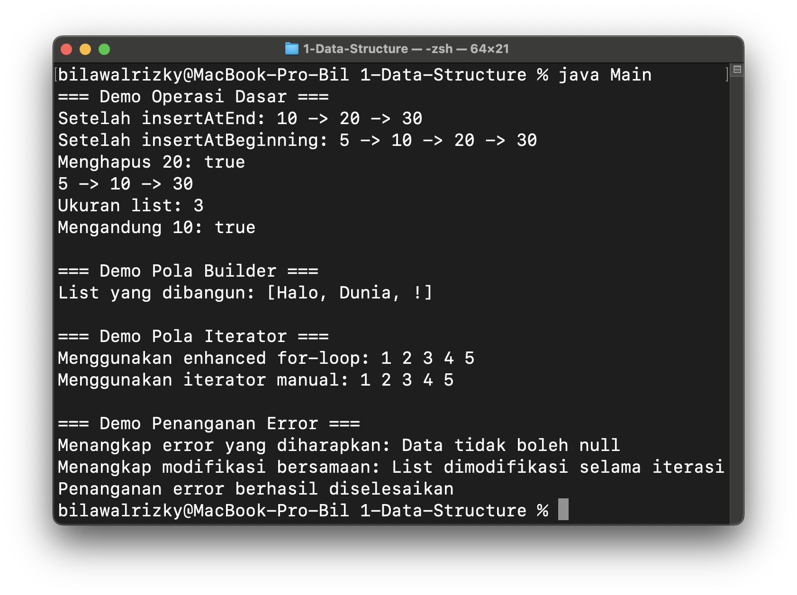

#### 1. Bagaimana memori untuk `list` dialokasikan dan dikelola dalam metode `createList`?
**Jawaban**:
- Tidak ada metode `createList` dalam kode yang diberikan
- Dalam konteks `countPairs()`: HashMap dialokasikan di heap, variabel primitif di stack
- JVM mengelola alokasi otomatis via `new HashMap<>()`

#### 2. Apa yang akan terjadi pada memori yang dialokasikan untuk `list` setelah metode `createList` selesai dieksekusi?
**Jawaban**:
- Stack frame method akan dibersihkan (variabel lokal: `freqMap`, `count`, `complement`)
- Heap objects (`HashMap` + `entries`) menjadi eligible untuk `GC` karena tidak ada referensi external
- Automatic cleanup - tidak perlu manual intervention

#### 3. Apakah ada potensi kebocoran memori dalam kode di atas?
**Jawaban**:
- TIDAK ADA memory leak dalam kode `PairSum`
- Reasoning:
  - `HashMap` bersifat lokal, tidak ada static references
  - Tidak ada circular references yang problematik
  - Tidak ada resource management (`files`, `connections`) yang tidak ditutup
  - `GC` akan membersihkan otomatis setelah method selesai

---

## (2) Linux Task
1. **Pencarian File Berdasarkan Ekstensi file (MANAGEMENT FILE)**

    Buatlah sebuah shell script yang menerima dua parameter: direktori dan ekstensi file. Script ini harus mencari semua file dengan ekstensi yang diberikan di dalam direktori tersebut dan menampilkan daftar nama file yang ditemukan.

- **Jawaban**: [1 - find_by_extension.sh](./2-Linux-Task/1_find_by_extension.sh)
- **Hasil**: 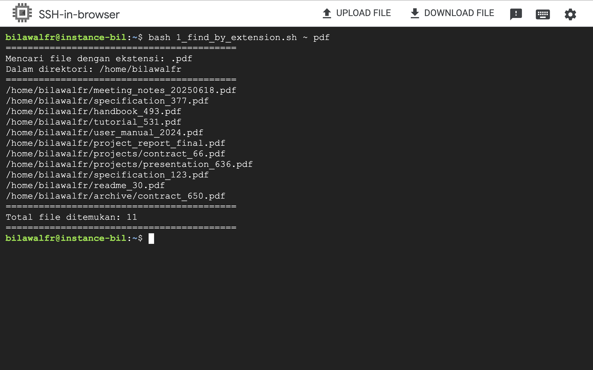

2. **Automasi Pembaharuan Sistem (BASIC SYSTEM)**

    Buatlah sebuah shell script yang akan secara otomatis memperbaharui semua package di sistem menggunakan package manager yang sesuai dengan family linux (misal ‘apt’, ‘yum’ atau sebagainya). Script harus juga mencatat hasil dari setiap pembaruan kedalam sebuah file log.

- **Jawaban**: [2 - system_update.sh](./2-Linux-Task/2_system_update.sh)
- **Hasil**: 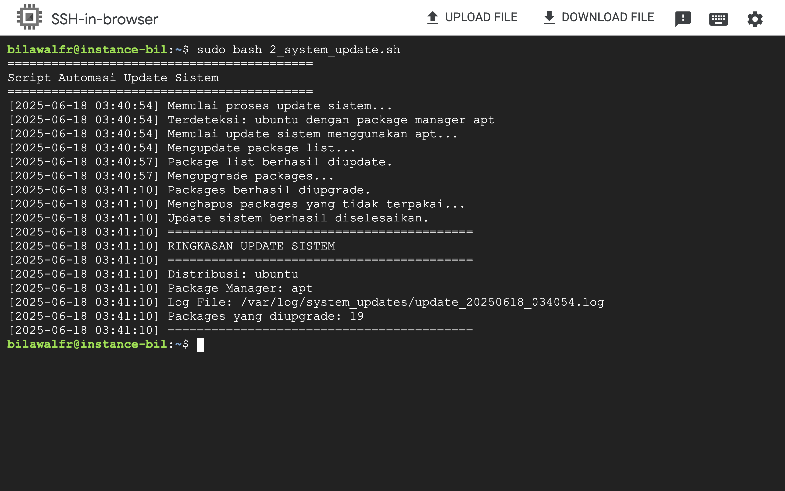

3. **Membuat dan Menyimpan SSH Key (SSH)**

    Buatlah sebuah shell script yang akan membuat sepasang SSH Key (public dan private) dengan menggunakan ssh-keygen dan menyimpannya di direktori yang ditentukan oleh pengguna sebagai parameter. Jika direktori tidak ada, script harus membuatnya terlebih dahulu.

- **Jawaban**: [3 - ssh_key_generator.sh](./2-Linux-Task/3_ssh_key_generator.sh)
- **Hasil**: 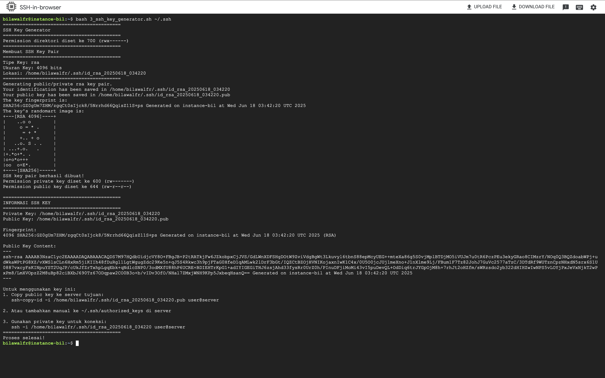

4. **Pengelolaan Service (SERVICE)**

    Buatlah sebuah shell script yang dapat memulai,
    menghentikan, dan memeriksa status dari sebuah service
    tertentu di sistem. Script harus memiliki parameter untuk menentukan tindakan yang diinginkan (start, stop, status) dan nama service.

- **Jawaban**: [4_service_manager.sh](./2-Linux-Task/4_service_manager.sh)
- **Hasil**: 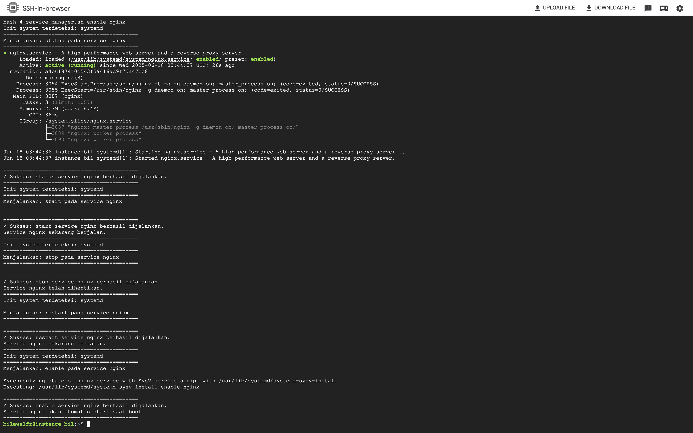

5. **Men-copy Direktori ke Server Remote (SCP)**

    Buatlah sebuah 2 shell script (scp, dan rsync) yang menerima tiga parameter: file source, username, dan ip address server tujuan. Script ini harus menyalin file tersebut ke direktori home pengguna di server remote menggunakan ‘scp’ dan ‘rsync’.

- **Jawaban**: 
- [5a - remote_copy_scp.sh](./2-Linux-Task/5a_remote_copy_scp.sh)
- **Hasil**: 
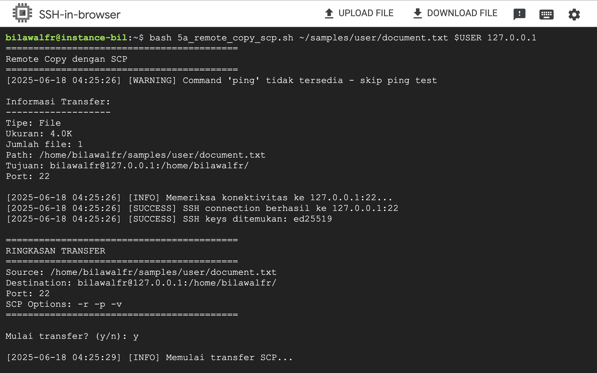
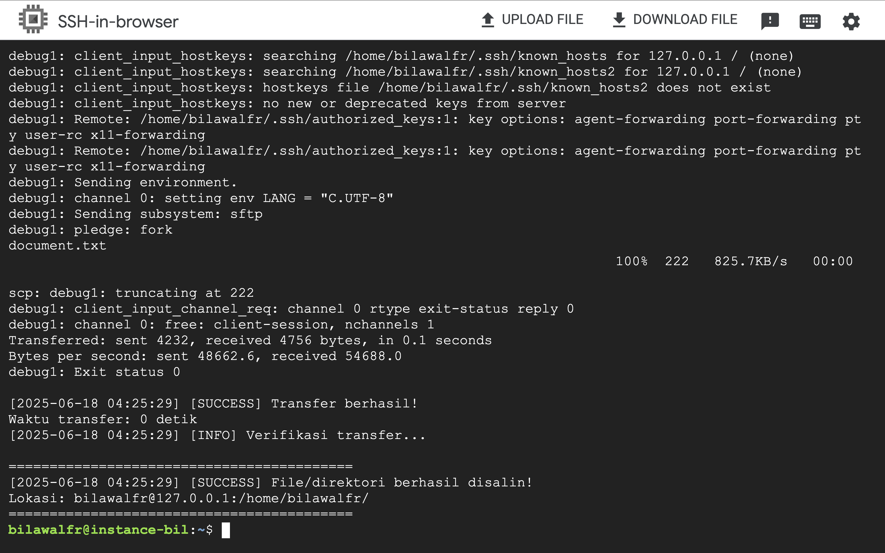

- [5b - remote_copy_rsync.sh](./2-Linux-Task/5b_remote_copy_rsync.sh)
- **Hasil**: 
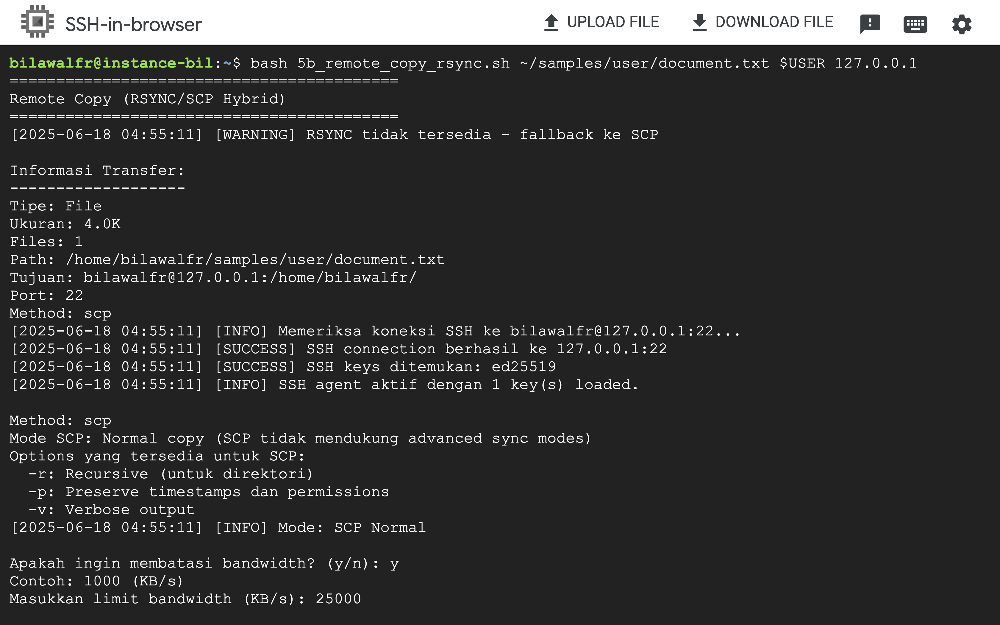
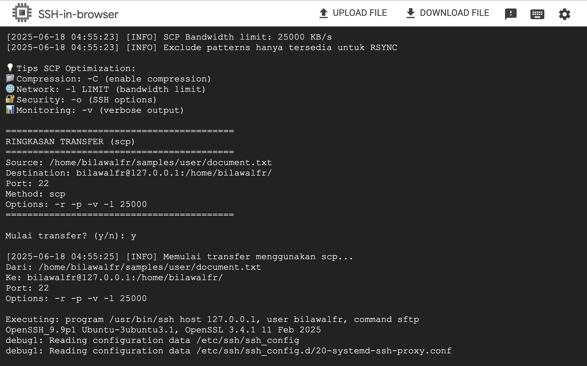
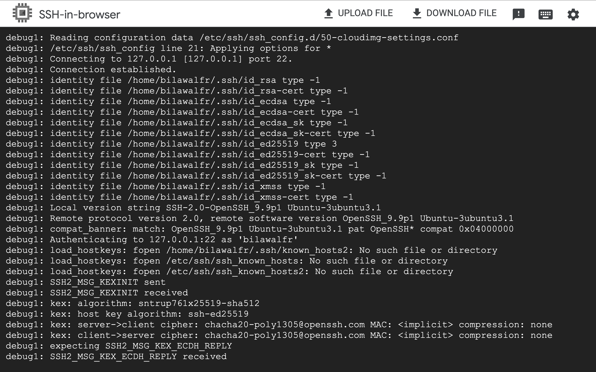
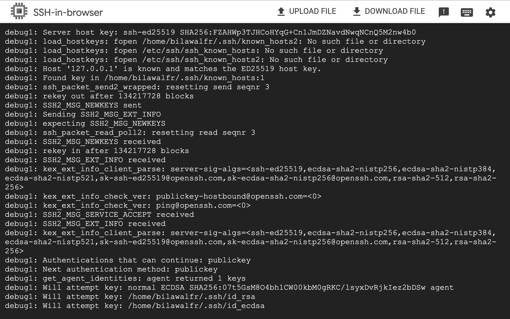

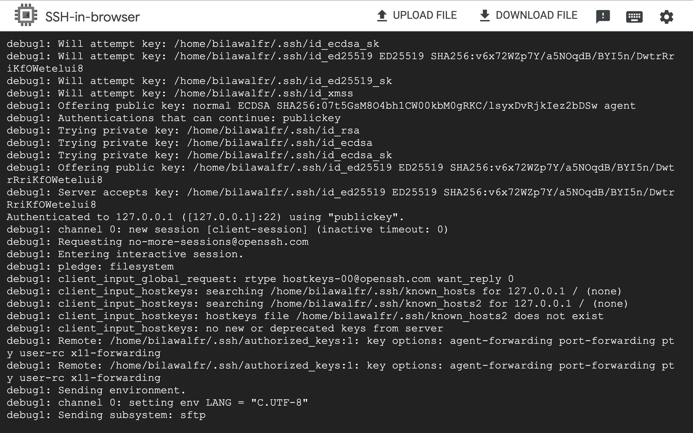
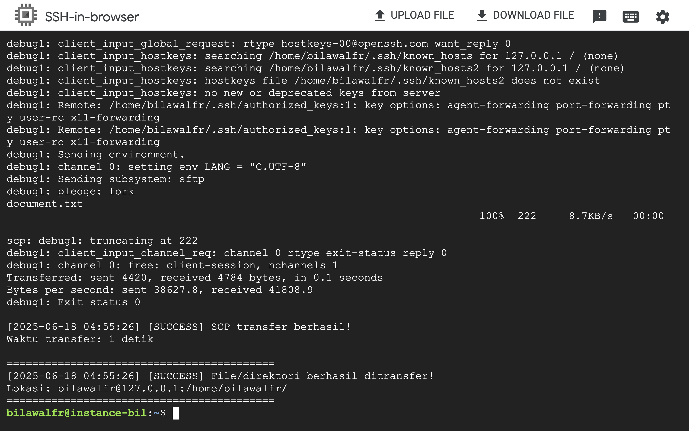

---

## 3) IT Support & Software Engineer - Koordinasi

### Pertanyaan:
Anda menemukan bahwa ada isu kritis yang mempengaruhi sistem production dan memerlukan koordinasi dengan tim support dan engineer. Jelaskan langkah-langkah yang akan Anda ambil untuk mengkoordinasikan penyelesaian masalah ini?

### **Jawaban**:

Saya akan menggunakan **Incident Response Framework** yang praktis dan sesuai dengan business model **Parkee**:

Alur yang akan kita jalankan: **Pertama, saya akan jadi Incident Commander untuk koordinasi keseluruhan.** Tim Support, handle customer complaints yang masuk dan update status page setiap 30 menit - jangan biarkan customer bingung. Sementara tim Engineering, langsung check monitoring dashboard dan logs untuk identify root cause. Kita buat channel Slack/Whatsapp khusus untuk incident ini dan semua update harus di-post disana, jadi semua orang tau progress terkini.

**Kedua, kita bagi tugas berdasarkan expertise masing-masing.** Engineering team fokus di technical debugging - cek apakah ini issue dari recent deployment, database load, atau external service. Kalau perlu rollback, langsung eksekusi dan inform ke semua. Support team, sambil handle customer, tolong catat juga pattern complaints yang masuk - apakah semua user affected atau hanya segment tertentu. QA team siap-siap untuk verify fix begitu Engineering selesai implement solution. Setiap 15 menit kita sync progress di channel, dan setiap jam saya akan update ke management.

**Ketiga, begitu issue resolved, kita langsung masuk fase post-mortem.** Dalam 48 jam ke depan, kita akan duduk bareng untuk review timeline kejadian, root cause analysis pakai 5 Whys, dan yang paling penting - bikin action items untuk prevent hal serupa terulang. Ini bukan tentang nyari siapa yang salah, tapi bagaimana kita improve system dan process kita. Engineering akan update monitoring alerts, Support akan update knowledge base berdasarkan customer feedback, dan kita semua akan update runbook. Intinya, setiap incident adalah learning opportunity untuk bikin tim lebih robust.

#### 1. IMMEDIATE RESPONSE (0-5 menit)

- **Identifikasi severity:** P1 (Critical) / P2 (High) / P3 (Medium)
- **Alert tim via Slack/WhatsApp:** @oncall-engineer @support-lead
- **Buat incident ticket** di Jira/Trello dengan template:
  - Error description & screenshot
  - Affected services/users
  - Time started
  - Initial impact assessment


#### 2. WAR ROOM ACTIVATION (5-15 menit)
**Setup komunikasi:**
- Slack channel: `#incident-[date]-[issue]`
- Google Meet untuk koordinasi real-time

**Tim inti:**
```
- Incident Lead: Koordinator & decision maker
- Engineer: Debug & implement fix  
- Support: Handle customer & update status
- QA: Test & verify fix
```

#### 3. COORDINATE & EXECUTE (15+ menit)

**Pembagian tugas jelas:**
```
SUPPORT TEAM:
- Respond customer complaints
- Update status page setiap 30 menit
- Collect user feedback & patterns

ENGINEERING TEAM:
- Check monitoring (Grafana/Datadog)
- Analyze logs & identify root cause
- Implement fix/rollback
- Deploy & monitor

COMMUNICATION:
- Internal update: Setiap 15 menit
- Customer update: Setiap 30 menit
- Management update: Setiap jam
```

#### 4. RESOLUTION WORKFLOW
```
1. Quick Fix:
   - Hotfix deployment (jika minor)
   - Rollback (jika recent deployment)
   - Scale resources (jika load issue)

2. Verification:
   - QA test critical flows
   - Monitor metrics 30 menit
   - Confirm dengan sample users

3. Documentation:
   - Update incident log
   - Document temporary fix
   - Schedule permanent solution
```

#### 5. POST-INCIDENT (dalam 48 jam)

**Blameless Post-mortem:**
```
Format sederhana:
1. Timeline & Kronologi
2. Root cause (5 Whys)
3. What worked & what didn't
4. Action items:
   - Immediate: Bug fix, monitoring
   - Long-term: Architecture improvement
   - Process: SOP update
```

**Follow-up actions:**
- Share learning di engineering meeting
- Update runbook & monitoring alerts
- Track completion action items

### TOOLS PRAKTIS

**Untuk tim Parkee (50-100 orang):**
```
Communication: Slack/Discord + WhatsApp backup
Monitoring: Grafana/Datadog/New Relic
Ticketing: Jira/Linear/Trello
Status Page: Statuspage.io/Cachet
Documentation: Notion/Confluence
```

### KEY PRINCIPLES
1. **Speed over perfection** - Fix dulu, optimize kemudian
2. **Clear ownership** - Setiap task ada PIC-nya
3. **Over-communicate** - Better too much than too little
4. **No blame culture** - Focus on system, not person
5. **Learn & improve** - Setiap incident = learning opportunity

### METRICS TO TRACK
- **MTTD** (Mean Time To Detect): < 5 menit
- **MTTA** (Mean Time To Acknowledge): < 10 menit  
- **MTTR** (Mean Time To Resolve): < 2 jam untuk P1
- **Customer Impact**: Jumlah user affected
- **Post-mortem completion**: 100% untuk P1/P2

Dengan framework ini, tim **Parkee** dapat menangani production issues secara terstruktur, cepat, dan efektif sambil tetap menjaga komunikasi yang baik dengan semua stakeholder.

---

## (4) Scripting Data

Anda diberikan beberapa file CSV yang berisi data transaksi dari berbagai cabang sebuah toko. Setiap file berisi kolom
berikut:
- transaction_id 
- branch
- date
- product_id
- quantity
- price
- customer_id

**Jawaban**:
[ScriptData.py - (Scripting data)](./4-Scripting-Data/ScriptData.py)

**Hasil:**
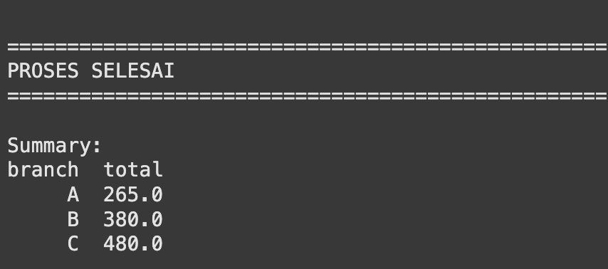

---

## (5) Parking POS

You are asked to create a Parking POS program. There are two pages in this program, one is for check-in, and the other is for check-out. The user must be able to input the vehicle plate number and submit it as a ticket on the check-in page. The user must be able to input the vehicle plate number and obtain a ticket based on the vehicle plate number. The system must show the ticket's check-in time, check-out time, and the total price on the check-out page. The total price is calculated based on the length of time between check-in time and check-out time with the rate of 3000 per hour. 

After the ticket's needed information is shown, the user can submit
the ticket as a finished transaction. In a single instance,
vehicles with the same vehicle plate number are unable to be in a parking area at the same time, the system should notify the user on the check-in page when this occurrence happens.

**Jawaban:**
- [Web Application - (Front-End)](./5-Parking-POS/parking-pos-web)
- [Aplication Service - (Back-End)](./5-Parking-POS/parking-pos-service)
- [Dump SQL - (Data Base)](./5-Parking-POS/parkee-pos-dump-parking_pos_db-202506171608.sql)

**Hasil:**
- Web App: https://parkee-web-3763bcd24d03.herokuapp.com
- Open API: https://parkee-service-45beed2c9ede.herokuapp.com/api